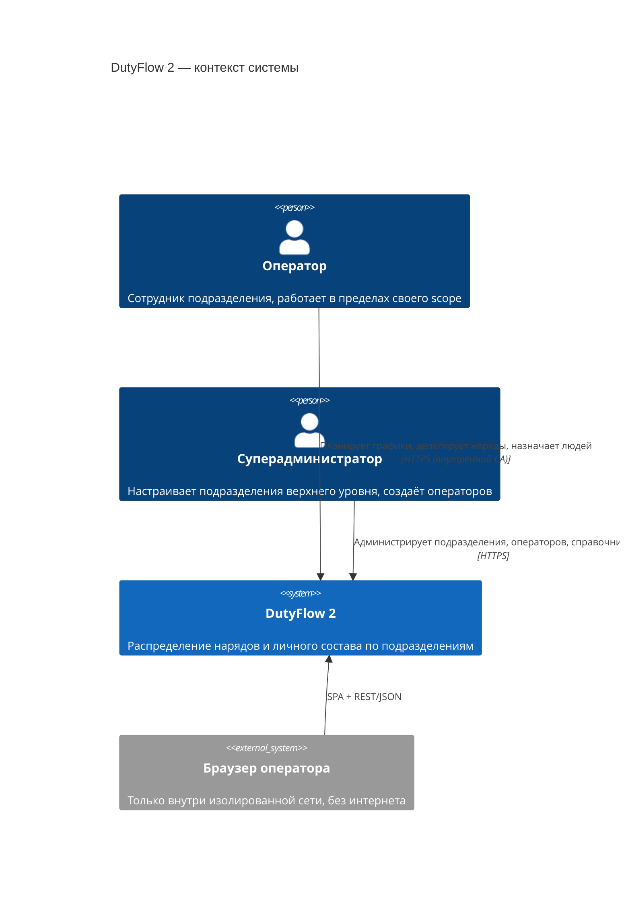
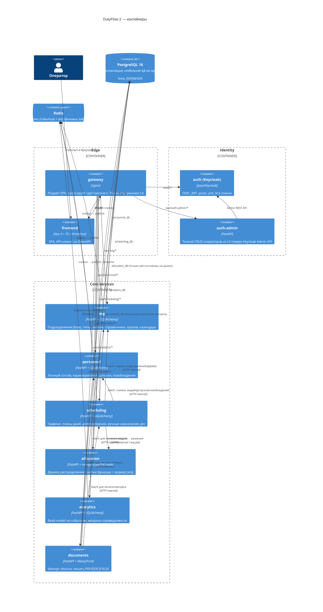
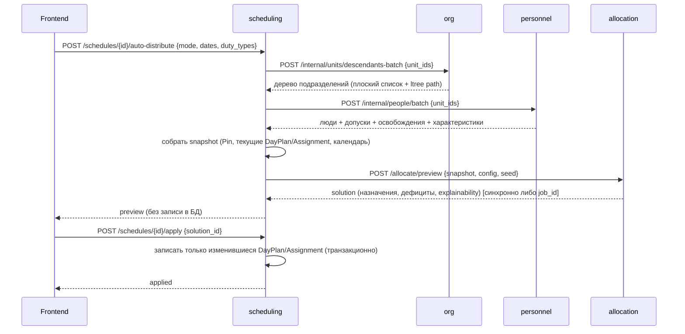

# Целевая архитектура DutyFlow 2

## 1. C4 — Context

Система работает **полностью офлайн**: нет внешних систем-интеграций, нет CDN, нет телеметрии. Единственная "внешняя" зависимость — сама изолированная сеть учреждения (браузеры операторов).

## 2. C4 — Container

## 3. Сервисы: зона ответственности, сущности, API, события

### 3.1 `org`

**Сущности:** `UnitType`, `Unit` (дерево через `ltree`), `Rank`, производственный календарь (праздники/переносы), справочники (например, справочник причин освобождений, если не жёстко зашит).

**Публичный API (черновик):**
- `GET/POST /units`, `GET/PATCH/DELETE /units/{id}`, `GET /units/{id}/subtree`, `GET /units/{id}/ancestors`
- `GET/POST /unit-types`
- `GET/POST /ranks`
- `GET/POST /calendar/holidays`
- `GET /units:search?scope=...` — для выпадающих списков на фронте

**Внутренний batch-API (для `scheduling`/`documents`/`allocation` через `scheduling`):**
- `POST /internal/units/batch` — `{unit_ids: [...]}` → плоский снимок узлов с `parent_id`, `unit_type_id`, `level`, путём `ltree`
- `POST /internal/units/descendants-batch` — `{unit_ids: [...]}` → все потомки одним запросом (замена рекурсии из legacy)

**События (publish):** `unit.created`, `unit.moved`, `unit.deleted`, `unit_type.changed`, `rank.changed`, `calendar.changed`.

**Не хранит:** людей, наряды, назначения.

### 3.2 `personnel`

**Сущности:** `Person`, `Position` (справочник должностей, ADR-0005), `AttributeDefinition` (типизированные определения характеристик, ADR-0005), `PersonAttributeValue` (JSONB), `Clearance` (допуск к **роли** наряда с опциональным сроком `valid_from`/`valid_to` и флагом `overrides_requirements`, ADR-0009), `Exemption`.

При выдаче допуска `personnel` проверяет человека на соответствие требованиям роли (batch-запрос требований в `scheduling`). При несоответствии выдаётся предупреждение, выдача возможна после подтверждения с комментарием и пишется в аудит.

**Публичный API:**
- `GET/POST /people`, `GET/PATCH/DELETE /people/{id}`
- `GET/POST /people/{id}/clearances` (ответ с предупреждениями о несоответствии требованиям; повторный `POST` с `confirm_override` и комментарием), `GET/POST /people/{id}/exemptions`
- `GET/POST /attribute-definitions`, `GET/POST /positions`
- `GET /reports/clearance-mismatches` — действующие допуски, не проходящие текущие требования ролей

**Внутренний batch-API:**
- `POST /internal/people/batch` — `{unit_ids: [...]}` → все люди этих подразделений с рангом, характеристиками, допусками, освобождениями за диапазон дат — **одним запросом**, специально для сборки снимка задачи в `scheduling`.
- `POST /internal/people/availability-batch` — `{person_ids, date_from, date_to}` → битовые маски доступности (освобождения свёрнуты в интервалы).

**События:** `person.created/updated/deleted`, `clearance.granted/revoked`, `exemption.created/cancelled`.

### 3.3 `scheduling`

**Сущности:** `DutyType` (создатель, закреплённое подразделение, шаблон времени `start_time` + `duration`, `rest_hours`, ADR-0008), `DutyRole` (состав по ролям: численность и требования — мин. звание, характеристики, допустимые должности, ADR-0009), `DutyLimit` (настраиваемый лимит нарядов на человека за период по подразделению, званию или должности; может отсутствовать), `Schedule` (подразделение × месяц, draft/published/archived), `DayPlan` (дата начала × тип наряда × **роль** → подразделение-исполнитель, статус делегирования), `Assignment` (человек → ячейка; флаг `rest_override` с комментарием для ручного нарушения отдыха). Ручное закрепление (pin), которое движок обязан уважать, — флаг `is_pinned` на `DayPlan` (закреплён исполнитель) и `Assignment` (закреплён человек). Полная схема таблиц — `docs/data-model.md`.

**Ответственность:**
- Workflow делегирования вниз по дереву **по ролям** (наследует legacy-механизм): `pending → accepted`, дальше рекурсивная передача вниз. Дочернее подразделение не может отклонить наряд, срока принятия нет (ADR-0009). При публикации графика родителя непринятые ячейки поддерева показываются как предупреждение.
- Проверка при ручном назначении: действующий допуск, освобождения, «≤ 1 наряда в сутки», отдых (нарушение разрешено только с `rest_override`), лимиты.
- Сборка «снимка задачи» для `allocation`: батч-вызовы в `org` (дерево, ранги, календарь) и `personnel` (люди, допуски, освобождения) → единый JSON/Arrow-снимок, который отправляется в `allocation` как **вход чистой функции**.
- Хранение решения движка и применение его (паттерн preview → apply, унаследованный из legacy).
- Ручные назначения и закрепления (pin), которые ограничивают следующий прогон движка.

**Публичный API:**
- `GET/POST /schedules`, `POST /schedules/{id}/publish`, `POST /schedules/{id}/archive`
- `GET /schedules/{id}/table` — аналог `build_table_rows` из legacy
- `POST /schedules/{id}/delegate` — принять решение о делегировании ячейки
- `GET/POST /duty-types`, `GET/POST /duty-types/{id}/roles`, `GET/POST /duty-limits`
- `POST /day-plans/{id}/accept`
- `POST /day-plans/{id}/assignments`, `DELETE /assignments/{id}`
- `POST /day-plans/{id}/pin`

**Внутренний API:**
- `POST /internal/schedules/{id}/snapshot` — синхронный вызов `allocation` (для маленьких задач) или постановка arq-задачи (для больших)
- Consumer событий `person.*`, `unit.*`, `clearance.*` для инвалидации кэша снимков (не для мутации своих данных — `scheduling` не хранит копию чужих данных, только id-ссылки).

**События (publish):** `schedule.published`, `day_plan.delegated`, `day_plan.accepted`, `assignment.created/removed`, `duty_type.changed`, `duty_role.changed`.

**Внутренний batch-API для `personnel`:** `POST /internal/duty-roles/batch` — требования ролей для проверки при выдаче допуска.

### 3.4 `allocation`

**Ответственность:** движок распределения как **чистая функция** `(снимок, конфигурация, seed) → решение`, не обращающаяся к БД напрямую, плюс воркер (arq) для долгих прогонов (CP-SAT на большом подразделении).

Почему чистая функция:
1. **Детерминизм и тестируемость** (требование CLAUDE.md #6) — легко фаззить, сравнивать бенчмарки, воспроизводить баг по сохранённому снимку без поднятия всей системы.
2. **Изоляция от инфраструктуры** — движок не должен знать про HTTP/ORM/очереди; это чистые numpy/scipy/OR-Tools вычисления над матрицами. Инфраструктурный код (загрузка снимка, публикация решения) живёт в тонком слое вокруг функции.
3. **Переиспользование в бенчмарках** (`tools/bench`) — тот же код гоняется на синтетических данных без поднятия сервисов.

**Публичный/внутренний API:**
- `POST /allocate/preview` — синхронно для маленьких задач (день/подразделение), синхронно с таймаутом для средних, иначе 202 + `job_id`
- `GET /jobs/{id}` — статус долгой задачи (CP-SAT на большом подразделении)
- `POST /allocate/apply` — фиксирует ранее посчитанный `job_id`/`preview_id` (сам `allocation` не пишет в `scheduling`, а возвращает решение, которое `scheduling` применяет — единый источник истины по данным остаётся у `scheduling`)

**Не имеет собственной предметной БД** — только служебная (job-очередь/статусы, если не полностью на Redis).

**Реализация (фаза 5b):** `POST /internal/solve` — синхронно; `POST /internal/jobs` и `GET /internal/jobs/{id}` — очередь arq в Redis, воркер `allocation-worker`. scheduling ставит в очередь большие снимки и явный CP-SAT и забирает результат при запросе прогона.

### 3.5 `analytics`

**Ответственность:** read-model, накапливаемый из событий `scheduling`/`personnel`/`org` (через Redis Streams), агрегаты нагрузки, метрики справедливости (Джини, Джайн, стандартное отклонение), API для дашбордов ECharts.

**API:** `GET /metrics/fairness`, `GET /metrics/load`, `GET /reports/deficits`.

Consumer, не producer домена — если недоступен, остальная система продолжает работать (аналитика не в критическом пути распределения).

**Реализация (фаза 6c):**
- **Read-model** `duty_fact` строится по событиям `assignment.created` / `assignment.removed` и `schedule.published` / `schedule.archived` из `scheduling`, подразделения — по общей проекции org. События несут всё для факта: занятые сутки, нагрузку, выходной или праздник, источник, статус графика. Их публикует `scheduling.facts` на всех путях, включая пересборку автораспределением и делегирование со снятием людей.
- **Начальное заполнение и восстановление** — `python -m analytics.rebuild` (`just analytics-rebuild`) из `GET /internal/assignments/facts` пачками; консьюмер делает это сам, если read-model пуста.
- **API:** `GET /metrics/overview` — сводка, справедливость (те же формулы, что в движке), подразделения, гистограмма, тренд, самые и наименее загруженные; `GET /metrics/people` — нагрузка по людям.
- Дефициты текущего месяца дашборд берёт из таблицы графика `scheduling`, а не дублирует ячейки в analytics.
- **Сводный журнал аудита** (фаза 7b): `audit_view` по событиям `events:audit` всех сервисов и выгрузке `GET /internal/audit`. API — `GET /audit` с фильтрами и выгрузкой в xlsx; права — `audit_journal` (open-questions №64).
- Отчёт по нагрузке печатает `documents` (`GET /print/load-report`) по данным `analytics` от имени оператора.

### 3.6 `documents`

**Ответственность:** выдача xlsx-шаблонов для заполнения и импорт xlsx/csv (превью + отчёт об ошибках до применения — тот же паттерн preview→apply; основной способ наполнения при этом — ручной ввод через UI), печать PDF (WeasyPrint)/DOCX/XLSX. Собирает данные батч-вызовами в `org`/`personnel`/`scheduling`, сам предметных данных не хранит (кроме статусов задач импорта/экспорта).

**Реализация импорта (фаза 6a, ADR-0014):**
- **Шаблон.** `GET /imports/templates/{kind}` — xlsx: столбцы и значения выпадающих списков описывает `personnel` (`GET /imports/{kind}/template`) для конкретного оператора.
- **Загрузка.** `POST /imports/{kind}` разбирает xlsx или csv и отправляет строки в `personnel` на проверку (`dry_run`); задача с файлом и результатом сохраняется.
- **Работа с задачей:** строки с фильтром по результату, отчёт xlsx с подсветкой ошибок, перепроверка, применение, отмена.
- **Применение.** `personnel` проверяет строки заново и сравнивает хэш с предпросмотром; при расхождении — 409, и задача перепроверяется автоматически.
- **Вызовы.** Все обращения к `personnel` — его публичный API с токеном оператора.

**Реализация печати (фаза 6b, ADR-0015):**
- **Формы:** `GET /print/schedules/{id}?format=pdf|xlsx` и `GET /print/daily?unit_id&date&form=daily_roster|daily_order&format=pdf|docx`. Данные — у `scheduling` (`/schedules/{id}/print`, `/rosters/daily`) от имени оператора.
- **Реквизиты:** `GET|PUT|DELETE /document-settings/{unit_id}`. Своих нет — действуют реквизиты ближайшего вышестоящего (цепочку отдаёт `org`).
- **Шаблоны:** `GET /templates`, `GET|PUT /templates/{form}`, `POST /templates/{form}/preview`, `POST /templates/{form}/reset` — только суперадминистратор.

### 3.7 `auth` / `auth-admin`

Keycloak — аутентификация, грубые роли (`superadmin`, `unit_admin`, `operator`, `viewer`), JWT с `unit_id`. `auth-admin` — тонкий FastAPI-сервис для создания операторов из UI поверх Keycloak Admin REST API (регистрация отключена, операторов создаёт администратор — см. ADR-0002).

**Реализация (фаза 7a, ADR-0016):**
- **API** `/operators`: список в зоне ответственности, создание с временным паролем, изменение роли и подразделения, блокировка, сброс пароля, завершение сессий.
- **Права** — по политике и дереву `org`, от имени оператора.
- **Keycloak** — служебный клиент `dutyflow-auth-admin` (client credentials). Клиент и политику паролей настраивает одноразовый контейнер `keycloak-init`.

## 4. Как `scheduling` собирает снимок для `allocation`

Снимок — самодостаточный (сериализуемый) объект: дерево подразделений, люди с допусками/рангом/характеристиками, освобождения как интервалы, текущие назначения и pin-ы, календарь праздников. `allocation` никогда не запрашивает `org`/`personnel` напрямую — только `scheduling` собирает снимок, что удерживает правило «сервисы не ходят в чужие БД» и делает движок тестируемым без сети. Формат снимка (JSON со словарями и индексами, версия, воспроизводимый hash) — ADR-0013; реализация — `scheduling/snapshot.py`, `GET /schedules/{id}/snapshot` (фаза 3c).

## 5. Согласованность данных

- **Outbox** в каждом сервисе-владельце данных (`org`, `personnel`, `scheduling`): доменное изменение и запись в outbox-таблицу — одна транзакция; отдельный релей публикует в Redis Streams и помечает как отправленное.
- **Идемпотентные обработчики**: каждое событие несёт `event_id`; консьюмеры (`analytics`, кэш-инвалидация в `scheduling`) хранят последний обработанный `event_id`/offset per stream per consumer group и игнорируют повторы.
- **Недоступность сервиса:**
  - `org`/`personnel` недоступны при сборке снимка → `scheduling` возвращает явную ошибку "не могу собрать снимок", не пытается закешировать вслепую устаревшие данные для *записи* (для *чтения* отображения таблицы допустимо использовать последний полученный по событиям локальный кэш id/имён, если он есть).
  - `allocation` недоступен → долгие задачи остаются в очереди arq/Redis, ретраятся с backoff; UI показывает статус "ожидание движка".
  - `analytics`/`documents` недоступны → не блокируют публикацию графика и назначения (не в критическом пути).
- Между сервисами **никогда** не шарится БД — только HTTP batch-эндпоинты (для request/response) и события (для последующей консистентности, например обновление read-model в `analytics`).

## 6. Модель доступа

**Выбор:** Keycloak выполняет аутентификацию (OIDC) и выдаёт грубые роли (`superadmin`, `unit_admin`, `operator`, `viewer`) плюс `unit_id` в JWT-claim. Тонкая авторизация (роль × ресурс × действие × scope по поддереву, + видимость полей/списков/меню) реализуется в `libs/common` как переиспользуемая библиотека политик — это прямое обобщение декларативной модели `access_control` из legacy (`AccessRule`/`AccessFieldRule`/`AccessChoiceRule`/`AccessMenuRule`), но:
- без дублирующего legacy-fallback (в новой системе — один движок, не два, как было в старой);
- без ORM-специфичной queryset-фильтрации — предикаты транслируются в SQL/`ltree`-условия (`path <@ 'unit.path'` и т.п.) на уровне каждого сервиса, но по общим правилам, которые отдаёт `libs/common`;
- scope вычисляется через `ltree`, а не рекурсию в Python (устраняет главный hot-path баг legacy, см. `docs/legacy-analysis.md` §4.3).

**Сравнение вариантов** — см. ADR-0002 (auth) и обоснование ниже:

| Вариант | Плюсы | Минусы |
|---|---|---|
| **Keycloak (грубые роли+unit_id) + собственная тонкая авторизация в `libs/common`** | Готовый OIDC/JWT, admin UI для создания операторов, не изобретаем hashing/sessions/MFA; тонкая логика (scope по дереву, поля, списки) всё равно specific для домена — нет смысла тащить в IdP | Ещё один компонент в офлайн-инсталляции (Java), realm export нужно версионировать |
| **Полностью свой auth-сервис** | Один язык (Python), меньше компонентов | Переизобретаем OIDC/JWT/refresh/hashing — риск для диплома и для безопасности, ADR всё равно потребуется обосновать выбор алгоритмов |
| **OPA (Open Policy Agent) для тонкой авторизации** | Единый Rego-язык политик, независимый от языка сервиса, hot-reload политик | Ещё один процесс на каждый под/сервис (sidecar) или отдельный агент, Rego — доп. язык для разработчика; сама scope-по-дереву логика (ltree-предикаты) всё равно проще выразить нативным SQL в `libs/common`, чем через Rego + внешние вызовы на каждый запрос списка |

Итог (детали — в ADR-0002): Keycloak для AuthN + грубых ролей, `libs/common` для тонкой AuthZ. OPA не выбран — оверхед для monorepo из 8 сервисов с одним языком (Python) не оправдан; можно пересмотреть, если появится многоязычный ландшафт.

## 7. Развёртывание и эксплуатация

Подробно — ADR-0017 и руководство администратора `deploy/README.md`.

- **Один хост, `docker compose`.** Проект `dutyflow`: 22 долгоживущих и одноразовых контейнера плюс служебный профиль `ops` (`ops-db` — резервные копии, `ops` — проверки изнутри сети).
- **HTTPS на внутреннем УЦ.**
  - Шлюз принимает 443 и перенаправляет с 80.
  - Внутри сети compose сервисы и Keycloak общаются по HTTP.
  - Корневой сертификат устанавливается на рабочие места один раз и при продлении сертификата сервера не меняется.
- **Поставка** — `dist/dutyflow-<версия>.tar`:
  - образы (`docker save`), compose с `pull_policy: never`;
  - `dutyflow.sh` с командами `install`, `update`, `backup`, `restore`, `doctor`, `certs`.
  - Секреты создаются на месте установки.
- **Данные и копии.** Тома PostgreSQL и Redis принадлежат проекту, а не каталогу версии, поэтому переход между версиями не трогает данные. Копия — `pg_dump` каждой БД и настройки стенда. Redis — только транспорт: при восстановлении он очищается.
- **Наблюдаемость:**
  - healthcheck у всех долгоживущих контейнеров: HTTP `/health` у сервисов, файл-пульс у релеев и консьюмеров;
  - `doctor` сводит состояние контейнеров, отставание очередей, DLQ, срок сертификата и свежесть копий.
