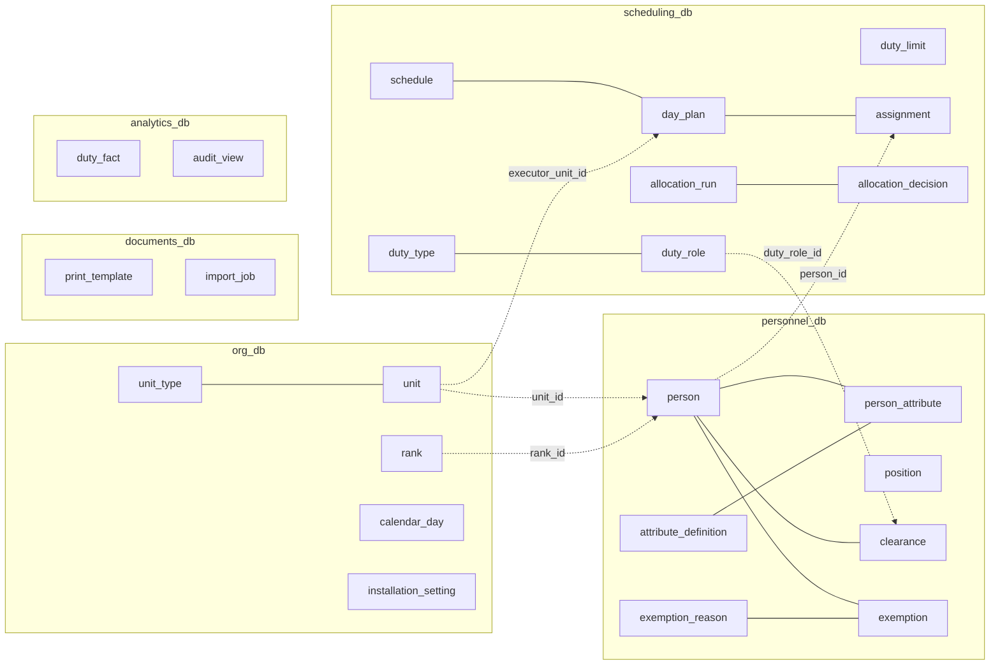

# Модель данных DutyFlow 2

> Статус: **утверждено 2026-09-26**. Изменения модели данных — только через ADR (правило `CLAUDE.md` №1). Основано на ADR-0003, 0005, 0008, 0009, 0010, 0011 и ответах в `docs/open-questions.md`.

## 1. Общие соглашения

| Соглашение | Решение | Почему |
|---|---|---|
| Идентификаторы | `uuid` (UUIDv7, генерируется в приложении) | Ссылки между сервисами без общей БД, импорт и превью без обращения к последовательностям, упорядоченность по времени для B-tree (ADR-0011) |
| Время | `timestamptz` в UTC для моментов; `date` для календарных дат; `time` + `interval` для шаблона наряда | Наряд привязан к локальной дате, часовой пояс инсталляции один (настройка `org`) |
| Служебные колонки | `created_at`, `updated_at`, `version int` у изменяемых сущностей | `version` для оптимистичной блокировки: два оператора редактируют одну ячейку, второй получает 409 |
| Удаление | Сущности, на которые ссылаются другие сервисы или история, **не удаляются физически**: `is_active=false` / `archived_at` | Старые графики и печатные формы должны показывать ФИО и подразделения |
| Ссылки между сервисами | Колонка `*_id uuid` без FK. Целостность проверяется сервисом при записи через batch-API владельца | Правило `CLAUDE.md` №5 |
| Scope-фильтрация | В каждом сервисе, где нужна фильтрация по поддереву, есть локальная проекция `unit_projection(unit_id, path)` из событий `org` | ADR-0011 |
| Аудит | Таблица `audit_log` в каждом сервисе, запись в той же транзакции, что и изменение | ADR-0010 |
| События | Таблица `outbox` в сервисах-продюсерах, `processed_event` у консьюмеров | ADR-0004 |
| Расширения PostgreSQL | `ltree` (org, проекции), `btree_gist` (scheduling, exclusion constraint) | |

Общие таблицы (`outbox`, `processed_event`, `audit_log`, `unit_projection`) описаны один раз в §7 и создаются миграциями каждого сервиса из шаблонов `libs/common`.

## 2. Обзор: кто чем владеет

Пунктир — ссылка по значению (`uuid`) без FK между БД.

## 3. `org_db`

### `unit_type`
| Колонка | Тип | Примечание |
|---|---|---|
| id | uuid PK | |
| code | text UNIQUE | `academy`, `faculty`, `course`, … |
| name | text | |
| level | smallint | 0 = верх иерархии |
| can_have_children | bool | |

### `unit`
| Колонка | Тип | Примечание |
|---|---|---|
| id | uuid PK | |
| node_no | bigint UNIQUE, identity | Метка узла в `path`. Не меняется при переименовании |
| parent_id | uuid FK → unit NULL | NULL только у корня |
| unit_type_id | uuid FK → unit_type | |
| name, short_name | text | |
| path | ltree NOT NULL | `1.17.342` — цепочка `node_no` от корня (ADR-0003) |
| sort_order | int | Порядок среди братьев |
| is_active | bool | Расформированное подразделение не удаляется |

Индексы: GiST(`path`), UNIQUE(`parent_id`, `name`) WHERE `is_active`. Перемещение поддерева — один `UPDATE … SET path = new || subpath(path, nlevel(old))  WHERE path <@ old` в транзакции, затем событие `unit.moved`.

### `rank`
`id`, `name`, `short_name`, `order smallint UNIQUE` (чем больше, тем старше), `is_active`.

### `calendar_day`
Исключения производственного календаря: `date PK`, `kind` (`holiday` / `workday` — рабочий перенос / `preholiday`), `name`. Выходные по дням недели не хранятся, а вычисляются.

### `installation_setting`
`key PK`, `value jsonb`. Например, `timezone`, `default_rest_hours = 48`.

## 4. `personnel_db`

### `position` — справочник должностей
`id`, `name`, `sort_order`, `is_active`.

### `person`
| Колонка | Тип | Примечание |
|---|---|---|
| id | uuid PK | |
| unit_id | uuid | Текущее подразделение. Перевод — просто смена значения, история только в аудите (`open-questions` №24) |
| last_name, first_name, middle_name | text | |
| rank_id | uuid | Ссылка на `org.rank` |
| position_id | uuid FK → position NULL | |
| personal_no | text NULL UNIQUE | Личный номер, если есть. Ключ сопоставления при импорте |
| is_active | bool | Уволенные/выпущенные архивируются, а не удаляются |
| archived_at | timestamptz NULL | |
| note | text NULL | |

Индексы: (`unit_id`) WHERE `is_active`; trigram-индекс по ФИО для поиска (`pg_trgm`).

Scope-фильтр: `JOIN unit_projection up ON up.unit_id = person.unit_id WHERE up.path <@ :scope_path`.

### `attribute_definition` (ADR-0005)
`id`, `code UNIQUE`, `name`, `value_type` (`bool`/`int`/`enum`/`date`/`string`), `enum_options jsonb NULL`, `is_required`, `sort_order`, `is_active`.
Стартовый набор: `category` (enum: курсант / слушатель / постоянный состав).

### `person_attribute`
`person_id FK`, `definition_id FK`, `value jsonb` (`{"v": …}`), PK(`person_id`, `definition_id`). GIN(`value`).

### `clearance` (ADR-0009)
| Колонка | Тип | Примечание |
|---|---|---|
| id | uuid PK | |
| person_id | uuid FK → person | |
| duty_role_id | uuid | Ссылка на `scheduling.duty_role` |
| valid_from, valid_to | date NULL | NULL = без ограничения |
| overrides_requirements | bool | Выдан вопреки требованиям роли |
| override_comment | text NULL | Обязателен, если флаг установлен (CHECK) |
| granted_by, granted_by_name | text | Оператор (subject из JWT) и его имя на момент выдачи — для карточки без обращения к Keycloak |
| granted_at | timestamptz | |
| revoked_at, revoked_by | NULL | Отзыв не удаляет строку |
| version | int | Меняется только срок действия |

Ограничения: UNIQUE(`person_id`, `duty_role_id`) WHERE `revoked_at IS NULL`; CHECK(`valid_to >= valid_from`).
Допуск выдаётся только к роли наряда подразделения человека или вышестоящего (ADR-0009, уточнения шага 2b).

### `duty_type_projection`, `duty_role_projection` — копия требований ролей из scheduling
`duty_type_projection(duty_type_id PK, name, short_name, owner_unit_id, is_active, source_version)`,
`duty_role_projection(duty_role_id PK, duty_type_id, code, name, sort_order, min_rank_order, allowed_position_ids uuid[], attribute_requirements jsonb, is_active, source_version)`.
Заполняются событиями `duty_type.changed` / `duty_role.changed`, при пустой копии — через `POST /internal/duty-roles/batch`. Нужны, чтобы проверка требований при выдаче допуска и отчёт о несоответствиях не зависели от доступности scheduling (ADR-0009).

### `exemption_reason`
`id`, `code UNIQUE` (`illness`, `leave`, `trip`, `other` + пользовательские), `name`, `is_active`.

### `exemption`
`id`, `person_id FK`, `reason_id FK`, `date_from date`, `date_to date` (включительно, `open-questions` №25), `comment`, `created_by`.
CHECK(`date_to >= date_from`); GiST(`person_id`, `daterange(date_from, date_to, '[]')`) для запросов пересечения с периодом графика.

## 5. `scheduling_db`

### `duty_type` (ADR-0008)
| Колонка | Тип | Примечание |
|---|---|---|
| id | uuid PK | |
| name, short_name | text | |
| owner_unit_id | uuid | Подразделение-создатель |
| assigned_unit_id | uuid NULL | Закреплённое подразделение (опционально) |
| start_time | time | Начало, локальное время |
| duration_minutes | int | CHECK 60 … 7·24·60 |
| rest_hours | int | По умолчанию 48 |
| load_weight | numeric(4,2) | Множитель нагрузки, по умолчанию 1.0 |
| is_active | bool | |
| version | int | |

UNIQUE(`owner_unit_id`, `name`) WHERE `is_active`. `assigned_unit_id` — внутри поддерева владельца.

### `duty_role` (ADR-0009)
| Колонка | Тип | Примечание |
|---|---|---|
| id | uuid PK | |
| duty_type_id | uuid FK | |
| code, name | text | UNIQUE(`duty_type_id`, `code`) |
| headcount | smallint | ≥ 1 |
| sort_order | smallint | |
| min_rank_order | smallint NULL | Мин. звание (по `rank.order`) |
| allowed_position_ids | uuid[] NULL | NULL = любая должность |
| attribute_requirements | jsonb | `[{"code":"category","op":"in","value":["курсант"]}]`; операторы `eq`, `in`, `gte`, `lte` |
| is_active | bool | |
| version | int | |

Требования используются только при выдаче допуска и в отчёте о несоответствиях. Движок их не видит.

### `duty_limit`
Лимит нарядов на человека за **календарный месяц** (`open-questions` №27).
| Колонка | Тип | Примечание |
|---|---|---|
| id | uuid PK | |
| unit_id | uuid | Где действует правило |
| applies_to_subtree | bool | На всё поддерево или только на это подразделение |
| rank_id, position_id | uuid NULL | Уточнение по званию/должности; NULL = все |
| max_duties | smallint NULL | Всего в месяц |
| max_holiday_duties | smallint NULL | Из них в выходные/праздники |

Разрешение: к человеку применяется **самое специфичное** правило — ближайшее по дереву подразделение, затем наличие `rank_id`/`position_id`. Правило разрешается при сборке снимка, движок получает уже готовый лимит на человека.

### `schedule`
`id`, `unit_id`, `month date` (первое число, CHECK), `status` (`draft`/`published`/`archived`), `published_at`, `published_by`, `version`. UNIQUE(`unit_id`, `month`). Опубликованный график можно менять с аудитом, архивный — только читать (open-questions №36).

### `calendar_projection`
Копия исключений производственного календаря org (`date PK`, `kind`, `name`) из событий `calendar.changed` и `POST /internal/calendar` — для выходных и праздников в таблице месяца и праздничных лимитов.

### `day_plan` — ячейка «дата × наряд × роль»
| Колонка | Тип | Примечание |
|---|---|---|
| id | uuid PK | |
| schedule_id | uuid FK | График подразделения, в котором видна ячейка |
| date | date | Дата начала (ADR-0008) |
| duty_type_id, duty_role_id | uuid FK | |
| origin | enum `own`/`incoming` | Своя ячейка или пришла от родителя |
| parent_day_plan_id | uuid FK → day_plan NULL | Для `incoming` — ячейка родителя |
| executor_unit_id | uuid | Кто закрывает роль. Роль делегируется **целиком** (`open-questions` №26) |
| delegation_status | enum `none`/`pending`/`accepted` | Для `incoming`: `pending → accepted`, отклонения нет |
| is_pinned | bool | Выбор исполнителя закреплён вручную, автораспределение его не трогает |
| version | int | |

Ограничения: UNIQUE(`schedule_id`, `date`, `duty_role_id`); UNIQUE(`parent_day_plan_id`) — у ячейки не больше одной дочерней; `parent_day_plan_id` ON DELETE CASCADE — смена решения родителем рекурсивно удаляет цепочку вниз (как в legacy); CHECK: у `own` нет родителя, у `incoming` есть.
Свои ячейки материализуются при создании графика (даты месяца × действующие роли своих нарядов) и следуют за составом ролей в неархивных графиках с текущего месяца. `executor_unit_id` — само подразделение графика или его прямое дочернее (open-questions №35). Делегировать входящую ячейку дальше — значит принять её. График подразделения создаётся автоматически при первом делегировании ему в этом месяце (фаза 3a).
Состояние «делегировано и принято ниже» (legacy `child_status`) не хранится, а вычисляется по дочерней ячейке одним JOIN.

### `assignment` — человек в ячейке
| Колонка | Тип | Примечание |
|---|---|---|
| id | uuid PK | |
| day_plan_id | uuid FK | Ячейка исполнителя |
| person_id | uuid | |
| start_at, end_at | timestamptz | Денормализовано из шаблона типа (ADR-0008) |
| occupied_days | daterange | Все сутки, которые занимает наряд |
| source | enum `manual`/`auto` | |
| is_pinned | bool | Закреплено вручную, движок не пересматривает |
| rest_override | bool | Ручное нарушение отдыха |
| override_comment | text NULL | Обязателен при `rest_override` (CHECK) |
| allocation_run_id | uuid FK NULL | Если назначено автоматически (появится с `allocation_run`, фаза 4) |
| assigned_by, assigned_by_name, assigned_at | | |
| person_name | text | «Фамилия И. О.» на момент назначения: таблица месяца не обращается в personnel |
| limit_override | bool | Ручное превышение месячного лимита (open-questions №38), комментарий обязателен |
| conflict | text NULL | Что изменилось у человека после назначения (исключён, переведён, освобождён, нет допуска) — назначение не снимается, а помечается (№39) |

Ограничения:
- UNIQUE(`day_plan_id`, `person_id`); число назначений ≤ `headcount` проверяется сервисом.
- Интервал `[start_at, end_at)` и `occupied_days` вычисляются из шаблона времени наряда в часовом поясе инсталляции (настройка `TIMEZONE`, та же, что у org).
- **`EXCLUDE USING gist (person_id WITH =, occupied_days WITH &&)`** — «не больше одного наряда в сутки» гарантируется на уровне БД, даже при гонке двух операторов. Отдых (48 ч) проверяется сервисом, потому что его можно нарушить вручную.

> Отдельная сущность `Pin` из `architecture.md` заменена флагами `is_pinned` на `day_plan` (закреплён исполнитель) и `assignment` (закреплён человек).

### `allocation_run` — прогон движка (preview → apply)
`id`, `schedule_id`, `kind` (`units` — между подразделениями / `people` — по людям), `mode` (`fill`/`rebuild`), `config jsonb`, `seed`, `snapshot_hash`, `snapshot bytea` (zlib-JSON), `solution_hash`, `status` (`preview_ready`/`applied`/`discarded`/`stale`/`failed`; `queued`/`running` — фоновый расчёт в очереди arq, фаза 5b), `job_id` (задача в очереди), `metrics jsonb` (недокомплект, граница, справедливость, время, дефициты, незакрытые места, снимаемые назначения), `created_by`, `created_by_name`, `created_at`, `applied_at`, `applied_by_name`.
`stale` — применение отклонено: hash свежего снимка отличается от сохранённого (open-questions №45).
Снимок хранится (сжатый JSON в `bytea` или файл в томе) ограниченное время — для воспроизведения «почему так распределено».

### `allocation_decision` — объяснимость
`run_id FK`, `day_plan_id`, `chosen_id` (person или unit), `chosen_name`, `rank smallint`, `cost`, `candidates` (сколько было допустимых), `features jsonb` (вектор признаков скоринга), `alternatives jsonb` (top-N кандидатов с признаками и именами), `rejected_summary jsonb` (сколько отсеяно и почему: нет допуска / освобождение / занят / отдых / лимит; для подразделений — ёмкость). PK(`run_id`, `day_plan_id`, `chosen_id`).

## 6. Остальные сервисы

- **`allocation_db`**: состояние задач, если не хватит arq/Redis — `job(id, run_id, status, started_at, finished_at, error)`. Предметных данных нет.
- **`documents_db`**:
  - `print_template(id, form, body, comment, is_active, created_by_name, created_at)` — загруженные HTML-шаблоны PDF-форм, версии не удаляются, действует последняя активная (шаг 6b, ADR-0015);
  - `document_settings(unit_id PK, approver_position, approver_rank, approver_name, compiler_position, compiler_rank, compiler_name, version, updated_by_name, updated_at)` — реквизиты подразделения, наследуются нижестоящими (шаг 6b);
  - `audit_log`, `outbox` — общие таблицы (изменения реквизитов и шаблонов);
  - `import_job` (шаг 6a):
    - поля: `id`, `kind` (`people` / `clearances` / `exemptions`), `status` (`preview` / `applied` / `discarded`), `filename`, `content` (файл), `columns`, `rows` (разобранные строки), `report` (результат проверки владельцем по строкам), `summary`, `state_hash`, `notes` (предупреждения разбора), `applied_rows`, `created_by`, `created_by_name`, `created_at`, `applied_at`;
    - видна только создателю, удаляется через 7 дней;
    - проверку и применение делает `personnel` (ADR-0014).
- **`analytics_db`** (read-model, строится из событий):
  - `duty_fact(assignment_id PK, person_id, unit_id, unit_path, duty_type_id, duty_role_id, date, occupied_days_count, holiday_days_count, load)`;
  - `audit_view` — сводный журнал аудита из событий `audit.recorded` всех сервисов (ADR-0010).
- **`auth_admin_db`**: только `audit_log` (операции с операторами). Сами операторы живут в Keycloak: `username`, ФИО, роль, атрибут `unit_id`.

## 7. Общие таблицы (`libs/common`)

### `unit_projection` (ADR-0011)
`unit_id PK`, `path ltree`, `name`, `is_active`, `last_event_id`. GiST(`path`). Заполняется консьюмером событий `unit.*`, при первом запуске — batch-вызовом `org`.

### `audit_log` (ADR-0010)
| Колонка | Тип | Примечание |
|---|---|---|
| id | uuid PK | |
| occurred_at | timestamptz | |
| actor_id | uuid | Оператор (`sub` из JWT) |
| actor_unit_id | uuid | |
| request_id | text | Сквозной id запроса |
| action | text | `person.update`, `clearance.grant_override`, `assignment.rest_override`, … |
| entity_type, entity_id | text, uuid | |
| scope_unit_id | uuid | Подразделение, к которому относится запись (для scope-фильтра просмотра) |
| before, after | jsonb | Было → стало (только изменённые поля) |
| comment | text NULL | Обязательный комментарий для override-операций |

Индексы: (`entity_type`, `entity_id`, `occurred_at`), (`scope_unit_id`, `occurred_at`). Только INSERT; права роли БД сервиса на UPDATE/DELETE таблицы отозваны.

### `outbox`
`id`, `aggregate_type`, `aggregate_id`, `event_type`, `payload jsonb`, `created_at`, `published_at NULL`. Индекс по `published_at IS NULL`.

### `processed_event`
`consumer`, `event_id`, `processed_at`, PK(`consumer`, `event_id`).

## 8. Оценка объёмов (верхняя граница НФТ)

| Таблица | Объём | Комментарий |
|---|---|---|
| unit | ~5 тыс. | 6+ уровней |
| person | 50 тыс. | |
| clearance | ~250 тыс. | ~5 ролей на человека |
| exemption | ~150 тыс./год | |
| day_plan | ~2–3 млн/год | тысячи подразделений × 5–20 нарядов × роли × 365, плюс цепочки делегирования |
| assignment | ~1–2 млн/год | |
| audit_log | ~5–10 млн/год | Партиционирование по месяцам (`occurred_at`) с фазы 7 |
| allocation_decision | крупнейшая при хранении top-N | Партиционирование по `run_id`/времени, срок хранения — настройка |

Все объёмы укладываются в одну инсталляцию PostgreSQL без шардинга. Горячие пути — scope-фильтр по `ltree` и exclusion constraint — индексные.
