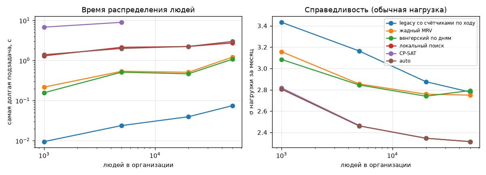
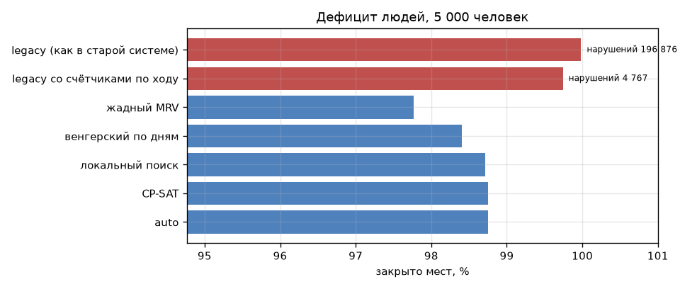
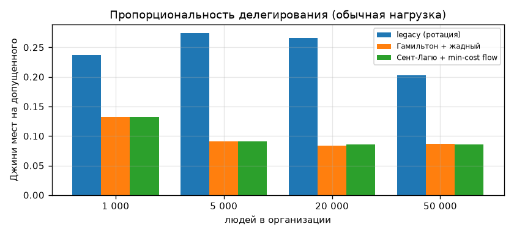
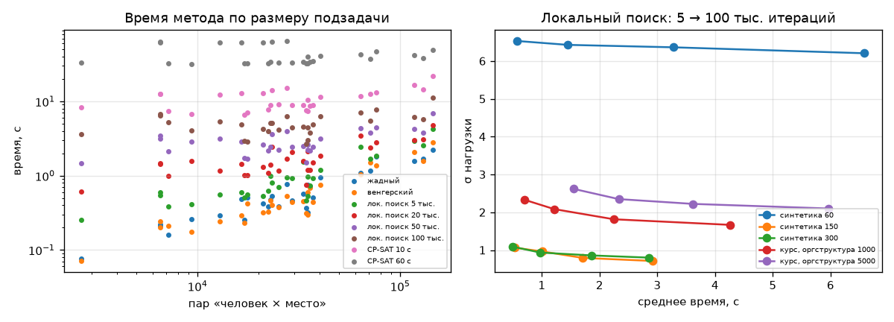
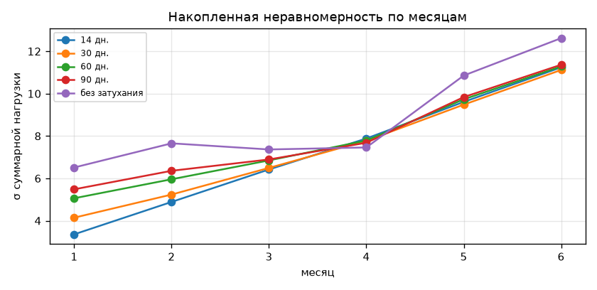

# Экспериментальная часть: методы распределения и сравнение с legacy

> Сгенерировано `just experiment` (`tools/experiment`). Windows AMD64, Python 3.12.0, numpy 2.5.3, scipy 1.18.1, OR-Tools 9.15.6755. Подзадачи решаются параллельно в 8 процессах, время каждой замеряется отдельно. Сырые данные — `docs/experiments/*.json`. Методика, выводы и принятые по итогам решения — в разделах ниже; исходная постановка — `docs/allocation-design.md`, «Экспериментальная часть», план — `docs/plans/phase-5.md`, шаг 5c.

## Методика

**Организация** (`tools/experiment/org.py`) — синтетическое дерево основного профиля (open-questions №4): 7 уровней (академия → факультет → отделение → блок курсов → курс → взвод → группа), ветви неравные (от 0,4 до 1,6 среднего ветвления), люди — в листьях, в среднем 25 на группу, размеры групп тоже неравные. Для 50 000 человек это около 2 000 подразделений.

**Наряды** есть у подразделений уровней 0–4: у каждого — свои типы нарядов и роли (дежурство 6 ч, сутки, трое суток; отдых 24–72 ч; вес 1 или 1,5), число мест в день пропорционально людям поддерева. Доли мест по уровням владельца: 10 / 15 / 15 / 20 / 40 % (академия … курс). Два сценария нагрузки: **обычная** — 1,3 наряда на человека в месяц в среднем, **дефицит** — 5 нарядов (людей заведомо не хватает на всё с учётом отдыха).

**Люди**: допуски к ролям нарядов своей цепочки подразделений (к каждой роли узла с вероятностью min(0,6; 3 / число ролей узла), у 5 % допуск начинает действовать с 11-го числа), освобождения у 12 % (2–14 дней), лимиты у 10 %. История — 90 дней нарядов до месяца без проверки правил: фон нагрузки, одинаковый для всех методов.

**Конвейер сверху вниз** (`tools/experiment/pipeline.py`) — декомпозиция уровня 0 на всей организации. Уровни 0–3 распределяют ячейки, которые держат (свои и полученные сверху), по прямым дочерним; курсы (уровень 4) назначают людей своего поддерева. Каждая подзадача — отдельный снимок ADR-0013 и чистая функция движка; подзадачи одного уровня независимы и решаются параллельно, как их решали бы операторы разных подразделений.

**Legacy-baseline** (`tools/experiment/legacy.py`) — логика `AssignmentAutomationService` и `PlanAutomationService` старой системы на тех же снимках, без ORM: тот же порядок обхода, счётчики, веса и сортировка (`docs/legacy-analysis.md` §2.4–2.5). Legacy не проверяет отдых, многосуточные наряды и лимиты, а занятость «в ту же дату» и счётчики месяца берёт из БД один раз на предпросмотр — выбор этого же прогона их не меняет. Поэтому у legacy два варианта:

- **как в старой системе** — дословно, со всеми её допущениями;
- **со счётчиками по ходу** — «лучшее прочтение» legacy: занятость и счётчики обновляются после каждого выбора, иначе сравнение сводилось бы к одной этой ошибке.

Перенос на модель новой системы: ячейка legacy «дата × тип наряда» стала «дата × роль», люди берутся из поддерева исполнителя (open-questions №37), допуск — к роли с учётом срока. Нарушения, которые допускает legacy, стенд не запрещает, а считает независимой проверкой `engine.verify` (у методов движка их нет по построению — это проверяется на каждом решении).

**Метрики**: закрытые места и строгая верхняя граница max-flow; нарушения по видам; справедливость среди допущенных хотя бы к одному наряду — стандартное отклонение σ и коэффициент Джини нагрузки (нарядо-сутки × вес), индекс Джайна, размах числа нарядов, σ нарядов в выходные и праздники; время — сумма по подзадачам и самая долгая подзадача; пик памяти — `tracemalloc` отдельным повтором (время замеряется без него: он замедляет numpy-код сильнее, чем чистый Python legacy). Всё, кроме времени и памяти, детерминировано по seed.

## E1. Методы распределения людей

Делегирование одно и то же (Сент-Лагю + min-cost flow), меняется только метод распределения людей в курсах. Отдельно — legacy целиком: его распределение по подразделениям и его же распределение людей. «Граница» — сумма строгих границ max-flow по курсам: больше закрыть нельзя, но граница не учитывает отдых и лимиты и поэтому может быть недостижима. Справедливость — по нагрузке за месяц (нарядо-сутки × вес) среди людей, допущенных хотя бы к одному наряду; размах — в числе нарядов. Время — сумма по подзадачам (процессорное) и самая долгая подзадача (столько ждёт оператор одного курса).

### 1 000 человек, обычная нагрузка

90 подразделений, 12 курсов, мест в месяц 1 670; seed: 3.

| Распределение по подразделениям / людей | Закрыто | % | Граница | Нарушения | σ нагрузки | Джини | Джайн | Размах | σ выходных | Время Σ, с | Макс. подзадача, с | Память, МБ |
|---|---:|---:|---:|---|---:|---:|---:|---:|---:|---:|---:|---:|
| legacy / legacy (как в старой системе) | 1 670 | 100,0 | 1 670 | 7 127 (освобождённые 2, сверх лимита 6, без отдыха 2 612, два наряда в сутки 4 507) | 27,81 | 0,969 | 0,033 | 103,3 | 3,00 | 0,1 | 0,01 | 1 |
| legacy / legacy со счётчиками по ходу | 1 670 | 100,0 | 1 670 | 34 (освобождённые 2, сверх лимита 6, без отдыха 21, два наряда в сутки 5) | 3,43 | 0,339 | 0,665 | 4,7 | 0,68 | 0,1 | 0,01 | 1 |
| жадный MRV | 1 670 | 100,0 | 1 670 | 0 | 3,16 | 0,351 | 0,704 | 6,0 | 0,58 | 1,2 | 0,22 | 5 |
| венгерский по дням | 1 670 | 100,0 | 1 670 | 0 | 3,08 | 0,345 | 0,713 | 5,7 | 0,57 | 0,9 | 0,16 | 5 |
| локальный поиск | 1 670 | 100,0 | 1 670 | 0 | 2,81 | 0,302 | 0,755 | 6,3 | 0,66 | 13,1 | 1,31 | 5 |
| CP-SAT | 1 670 | 100,0 | 1 670 | 0 | 2,82 | 0,303 | 0,754 | 6,3 | 0,65 | 75,0 | 6,80 | 5 |
| auto (local_search) | 1 670 | 100,0 | 1 670 | 0 | 2,81 | 0,302 | 0,755 | 6,3 | 0,66 | 12,9 | 1,40 | 5 |

### 1 000 человек, дефицит людей

90 подразделений, 12 курсов, мест в месяц 5 030; seed: 3.

| Распределение по подразделениям / людей | Закрыто | % | Граница | Нарушения | σ нагрузки | Джини | Джайн | Размах | σ выходных | Время Σ, с | Макс. подзадача, с | Память, МБ |
|---|---:|---:|---:|---|---:|---:|---:|---:|---:|---:|---:|---:|
| legacy / legacy (как в старой системе) | 5 030 | 100,0 | 5 028 | 44 936 (освобождённые 6, сверх лимита 15, без отдыха 15 951, два наряда в сутки 28 963) | 64,69 | 0,950 | 0,051 | 202,0 | 7,11 | 0,2 | 0,03 | 2 |
| legacy / legacy со счётчиками по ходу | 5 025 | 99,9 | 5 028 | 888 (освобождённые 4, сверх лимита 64, без отдыха 607, два наряда в сутки 212) | 7,13 | 0,248 | 0,808 | 11,7 | 1,22 | 0,2 | 0,06 | 2 |
| жадный MRV | 4 940 | 98,3 | 5 028 | 0 | 4,50 | 0,176 | 0,910 | 11,0 | 0,96 | 2,3 | 0,41 | 7 |
| венгерский по дням | 4 992 | 99,3 | 5 028 | 0 | 5,09 | 0,196 | 0,892 | 11,7 | 0,97 | 2,9 | 0,50 | 7 |
| локальный поиск | 4 999 | 99,4 | 5 028 | 0 | 4,90 | 0,187 | 0,899 | 12,3 | 1,14 | 24,4 | 2,73 | 7 |
| CP-SAT | 5 004 | 99,5 | 5 028 | 0 | 4,89 | 0,187 | 0,899 | 12,3 | 1,15 | 108,0 | 13,01 | 7 |
| auto (local_search, local_search+cpsat) | 5 005 | 99,5 | 5 028 | 0 | 4,90 | 0,187 | 0,899 | 12,3 | 1,15 | 45,1 | 8,14 | 7 |

### 5 000 человек, обычная нагрузка

329 подразделений, 31 курсов, мест в месяц 6 690; seed: 3.

| Распределение по подразделениям / людей | Закрыто | % | Граница | Нарушения | σ нагрузки | Джини | Джайн | Размах | σ выходных | Время Σ, с | Макс. подзадача, с | Память, МБ |
|---|---:|---:|---:|---|---:|---:|---:|---:|---:|---:|---:|---:|
| legacy / legacy (как в старой системе) | 6 690 | 100,0 | 6 690 | 36 374 (освобождённые 10, сверх лимита 27, без отдыха 13 245, два наряда в сутки 23 093) | 27,74 | 0,976 | 0,022 | 169,7 | 2,93 | 0,3 | 0,05 | 5 |
| legacy / legacy со счётчиками по ходу | 6 690 | 100,0 | 6 690 | 107 (освобождённые 8, сверх лимита 12, без отдыха 73, два наряда в сутки 14) | 3,16 | 0,375 | 0,620 | 5,3 | 0,61 | 0,3 | 0,02 | 5 |
| жадный MRV | 6 690 | 100,0 | 6 690 | 0 | 2,86 | 0,387 | 0,665 | 5,0 | 0,52 | 4,5 | 0,54 | 27 |
| венгерский по дням | 6 690 | 100,0 | 6 690 | 0 | 2,85 | 0,386 | 0,666 | 5,0 | 0,52 | 4,5 | 0,51 | 27 |
| локальный поиск | 6 690 | 100,0 | 6 690 | 0 | 2,46 | 0,326 | 0,729 | 5,7 | 0,57 | 37,9 | 2,13 | 27 |
| CP-SAT | 6 690 | 100,0 | 6 690 | 0 | 2,47 | 0,327 | 0,728 | 5,7 | 0,57 | 207,0 | 8,96 | 27 |
| auto (local_search) | 6 690 | 100,0 | 6 690 | 0 | 2,46 | 0,326 | 0,729 | 5,7 | 0,57 | 36,9 | 2,00 | 27 |

### 5 000 человек, дефицит людей

329 подразделений, 31 курсов, мест в месяц 24 780; seed: 3.

| Распределение по подразделениям / людей | Закрыто | % | Граница | Нарушения | σ нагрузки | Джини | Джайн | Размах | σ выходных | Время Σ, с | Макс. подзадача, с | Память, МБ |
|---|---:|---:|---:|---|---:|---:|---:|---:|---:|---:|---:|---:|
| legacy / legacy (как в старой системе) | 24 776 | 100,0 | 24 760 | 196 876 (освобождённые 35, сверх лимита 113, без отдыха 70 163, два наряда в сутки 126 565) | 61,24 | 0,929 | 0,055 | 238,7 | 6,62 | 1,0 | 0,10 | 16 |
| legacy / legacy со счётчиками по ходу | 24 716 | 99,7 | 24 760 | 4 767 (освобождённые 31, сверх лимита 310, без отдыха 3 115, два наряда в сутки 1 311) | 7,33 | 0,246 | 0,800 | 15,0 | 1,26 | 1,1 | 0,13 | 16 |
| жадный MRV | 24 226 | 97,8 | 24 747 | 0 | 4,35 | 0,171 | 0,915 | 11,0 | 0,94 | 12,6 | 1,21 | 48 |
| венгерский по дням | 24 384 | 98,4 | 24 747 | 0 | 4,90 | 0,191 | 0,897 | 11,7 | 0,97 | 10,9 | 1,15 | 48 |
| локальный поиск | 24 462 | 98,7 | 24 747 | 0 | 4,65 | 0,180 | 0,907 | 12,3 | 1,11 | 76,7 | 5,04 | 48 |
| CP-SAT | 24 471 | 98,8 | 24 747 | 0 | 4,66 | 0,180 | 0,906 | 12,3 | 1,11 | 355,0 | 19,00 | 48 |
| auto (local_search, local_search+cpsat) | 24 471 | 98,8 | 24 747 | 0 | 4,66 | 0,180 | 0,906 | 12,3 | 1,11 | 129,1 | 11,40 | 48 |

### 20 000 человек, обычная нагрузка

1 515 подразделений, 112 курсов, мест в месяц 26 415; seed: 2.

| Распределение по подразделениям / людей | Закрыто | % | Граница | Нарушения | σ нагрузки | Джини | Джайн | Размах | σ выходных | Время Σ, с | Макс. подзадача, с | Память, МБ |
|---|---:|---:|---:|---|---:|---:|---:|---:|---:|---:|---:|---:|
| legacy / legacy (как в старой системе) | 26 415 | 100,0 | 26 414 | 121 338 (освобождённые 42, сверх лимита 122, без отдыха 44 252, два наряда в сутки 76 922) | 24,74 | 0,962 | 0,025 | 167,0 | 2,69 | 1,2 | 0,05 | 22 |
| legacy / legacy со счётчиками по ходу | 26 408 | 100,0 | 26 414 | 427 (освобождённые 35, сверх лимита 50, без отдыха 243, два наряда в сутки 100) | 2,88 | 0,360 | 0,648 | 7,0 | 0,60 | 1,2 | 0,04 | 22 |
| жадный MRV | 26 415 | 100,0 | 26 415 | 0 | 2,76 | 0,388 | 0,666 | 5,5 | 0,51 | 17,8 | 0,51 | 132 |
| венгерский по дням | 26 415 | 100,0 | 26 415 | 0 | 2,74 | 0,386 | 0,669 | 5,5 | 0,51 | 16,0 | 0,47 | 132 |
| локальный поиск | 26 415 | 100,0 | 26 415 | 0 | 2,35 | 0,324 | 0,734 | 5,5 | 0,57 | 131,8 | 2,23 | 132 |
| auto (local_search) | 26 415 | 100,0 | 26 415 | 0 | 2,35 | 0,324 | 0,734 | 5,5 | 0,57 | 137,8 | 2,24 | 132 |

### 50 000 человек, обычная нагрузка

2 081 подразделений, 118 курсов, мест в месяц 65 250; seed: 1.

| Распределение по подразделениям / людей | Закрыто | % | Граница | Нарушения | σ нагрузки | Джини | Джайн | Размах | σ выходных | Время Σ, с | Макс. подзадача, с | Память, МБ |
|---|---:|---:|---:|---|---:|---:|---:|---:|---:|---:|---:|---:|
| legacy / legacy (как в старой системе) | 65 250 | 100,0 | 65 247 | 361 950 (освобождённые 79, сверх лимита 274, без отдыха 131 571, два наряда в сутки 230 026) | 27,46 | 0,954 | 0,021 | 205,0 | 2,89 | 3,4 | 0,08 | 83 |
| legacy / legacy со счётчиками по ходу | 65 240 | 100,0 | 65 247 | 812 (освобождённые 105, сверх лимита 81, без отдыха 437, два наряда в сутки 189) | 2,78 | 0,347 | 0,679 | 6,0 | 0,58 | 3,5 | 0,07 | 83 |
| жадный MRV | 65 250 | 100,0 | 65 250 | 0 | 2,75 | 0,381 | 0,683 | 4,0 | 0,50 | 52,1 | 1,22 | 505 |
| венгерский по дням | 65 250 | 100,0 | 65 250 | 0 | 2,79 | 0,387 | 0,677 | 4,0 | 0,51 | 47,3 | 1,08 | 505 |
| локальный поиск | 65 250 | 100,0 | 65 250 | 0 | 2,31 | 0,314 | 0,753 | 5,0 | 0,56 | 200,6 | 2,75 | 505 |
| auto (local_search) | 65 250 | 100,0 | 65 250 | 0 | 2,31 | 0,314 | 0,753 | 5,0 | 0,56 | 201,9 | 2,99 | 505 |

## E2. Распределение по подразделениям

Метод распределения людей в курсах один — локальный поиск, меняется только то, как ячейки спускаются по дереву. «Потеряно» — места в ячейках, которые не удалось передать ни одному дочернему (ни у кого нет столько свободных допущенных людей). «Джини долей» — неравномерность числа мест на допущенного человека между курсами: 0 — нагрузка разложена пропорционально людям. Время — этапа делегирования.

| Людей | Сценарий | Распределение по подразделениям | Потеряно | Закрыто | % | Джини долей | σ нагрузки | Время Σ, с | Макс. подзадача, с | Память, МБ |
|---:|---|---|---:|---:|---:|---:|---:|---:|---:|---:|
| 1 000 | обычная нагрузка | legacy (ротация) | 0 | 1 668 | 99,9 | 0,237 | 3,54 | 0,1 | 0,03 | 3 |
| 1 000 | обычная нагрузка | Гамильтон + жадный | 0 | 1 670 | 100,0 | 0,133 | 2,81 | 0,5 | 0,10 | 5 |
| 1 000 | обычная нагрузка | Сент-Лагю + min-cost flow | 0 | 1 670 | 100,0 | 0,132 | 2,81 | 0,6 | 0,12 | 5 |
| 1 000 | дефицит людей | legacy (ротация) | 0 | 4 917 | 97,8 | 0,194 | 6,58 | 0,4 | 0,08 | 5 |
| 1 000 | дефицит людей | Гамильтон + жадный | 2 | 5 000 | 99,4 | 0,054 | 4,89 | 1,5 | 0,34 | 7 |
| 1 000 | дефицит людей | Сент-Лагю + min-cost flow | 2 | 4 999 | 99,4 | 0,054 | 4,90 | 1,6 | 0,29 | 7 |
| 5 000 | обычная нагрузка | legacy (ротация) | 0 | 6 687 | 100,0 | 0,275 | 3,22 | 0,6 | 0,11 | 17 |
| 5 000 | обычная нагрузка | Гамильтон + жадный | 0 | 6 690 | 100,0 | 0,091 | 2,46 | 3,1 | 0,52 | 27 |
| 5 000 | обычная нагрузка | Сент-Лагю + min-cost flow | 0 | 6 690 | 100,0 | 0,091 | 2,46 | 3,7 | 0,66 | 27 |
| 5 000 | дефицит людей | legacy (ротация) | 4 | 23 749 | 95,8 | 0,227 | 6,06 | 2,2 | 0,36 | 21 |
| 5 000 | дефицит людей | Гамильтон + жадный | 29 | 24 447 | 98,7 | 0,036 | 4,66 | 7,9 | 1,33 | 48 |
| 5 000 | дефицит людей | Сент-Лагю + min-cost flow | 33 | 24 462 | 98,7 | 0,036 | 4,65 | 11,1 | 1,47 | 48 |
| 20 000 | обычная нагрузка | legacy (ротация) | 0 | 26 386 | 99,9 | 0,266 | 2,87 | 3,6 | 0,89 | 22 |
| 20 000 | обычная нагрузка | Гамильтон + жадный | 0 | 26 415 | 100,0 | 0,084 | 2,35 | 15,1 | 2,33 | 132 |
| 20 000 | обычная нагрузка | Сент-Лагю + min-cost flow | 0 | 26 415 | 100,0 | 0,086 | 2,35 | 19,7 | 2,70 | 132 |
| 50 000 | обычная нагрузка | legacy (ротация) | 0 | 65 228 | 100,0 | 0,202 | 2,73 | 20,0 | 5,14 | 83 |
| 50 000 | обычная нагрузка | Гамильтон + жадный | 0 | 65 250 | 100,0 | 0,087 | 2,32 | 42,8 | 6,16 | 505 |
| 50 000 | обычная нагрузка | Сент-Лагю + min-cost flow | 0 | 65 250 | 100,0 | 0,086 | 2,31 | 55,9 | 7,23 | 505 |

## E4. Методы на отдельных подзадачах и пороги режима auto

Подзадачи — курсы из оргструктур 1 000 и 5 000 человек при дефиците людей (как их получает конвейер E1) и малые синтетические снимки фазы 4. Каждый метод решает одну и ту же подзадачу; «+ к лок. поиску» — сколько мест метод закрыл сверх локального поиска с 20 тыс. итераций (по умолчанию), σ — нагрузки с затуханием, включая прошлые наряды (её и выравнивают методы). Время — одна подзадача, один поток.

| Подзадачи | Пар «человек × место» | Метод | Закрыто из мест | + к лок. поиску | Граница | σ | Время, с (сред. / макс.) |
|---|---:|---|---:|---:|---:|---:|---:|
| синтетика 60 (2) | 6 556 | жадный | 854 из 960 | -100 | 960 | 6,624 | 0,21 / 0,2 |
| синтетика 60 (2) | 6 556 | венгерский | 954 из 960 | 0 | 960 | 6,694 | 0,22 / 0,2 |
| синтетика 60 (2) | 6 556 | лок. поиск 5 тыс. | 954 из 960 | 0 | 960 | 6,531 | 0,57 / 0,6 |
| синтетика 60 (2) | 6 556 | лок. поиск 20 тыс. | 954 из 960 | 0 | 960 | 6,428 | 1,45 / 1,5 |
| синтетика 60 (2) | 6 556 | лок. поиск 50 тыс. | 954 из 960 | 0 | 960 | 6,363 | 3,28 / 3,4 |
| синтетика 60 (2) | 6 556 | лок. поиск 100 тыс. | 954 из 960 | 0 | 960 | 6,206 | 6,58 / 6,7 |
| синтетика 60 (2) | 6 556 | CP-SAT 10 с | 954 из 960 | 0 | 960 | 6,428 | 12,57 / 12,6 |
| синтетика 60 (2) | 6 556 | CP-SAT 60 с | 954 из 960 | 0 | 960 | 6,428 | 62,71 / 63,0 |
| синтетика 150 (2) | 17 328 | жадный | 960 из 960 | 0 | 960 | 1,918 | 0,38 / 0,5 |
| синтетика 150 (2) | 17 328 | венгерский | 960 из 960 | 0 | 960 | 1,669 | 0,33 / 0,4 |
| синтетика 150 (2) | 17 328 | лок. поиск 5 тыс. | 960 из 960 | 0 | 960 | 1,064 | 0,53 / 0,6 |
| синтетика 150 (2) | 17 328 | лок. поиск 20 тыс. | 960 из 960 | 0 | 960 | 0,962 | 1,01 / 1,0 |
| синтетика 150 (2) | 17 328 | лок. поиск 50 тыс. | 960 из 960 | 0 | 960 | 0,794 | 1,71 / 1,7 |
| синтетика 150 (2) | 17 328 | лок. поиск 100 тыс. | 960 из 960 | 0 | 960 | 0,713 | 2,92 / 2,9 |
| синтетика 150 (2) | 17 328 | CP-SAT 10 с | 960 из 960 | 0 | 960 | 0,962 | 6,76 / 7,0 |
| синтетика 150 (2) | 17 328 | CP-SAT 60 с | 960 из 960 | 0 | 960 | 0,962 | 32,10 / 32,1 |
| синтетика 300 (2) | 34 612 | жадный | 960 из 960 | 0 | 960 | 1,327 | 0,34 / 0,4 |
| синтетика 300 (2) | 34 612 | венгерский | 960 из 960 | 0 | 960 | 1,320 | 0,31 / 0,3 |
| синтетика 300 (2) | 34 612 | лок. поиск 5 тыс. | 960 из 960 | 0 | 960 | 1,091 | 0,49 / 0,5 |
| синтетика 300 (2) | 34 612 | лок. поиск 20 тыс. | 960 из 960 | 0 | 960 | 0,935 | 0,97 / 1,2 |
| синтетика 300 (2) | 34 612 | лок. поиск 50 тыс. | 960 из 960 | 0 | 960 | 0,859 | 1,87 / 2,2 |
| синтетика 300 (2) | 34 612 | лок. поиск 100 тыс. | 960 из 960 | 0 | 960 | 0,801 | 2,85 / 3,0 |
| синтетика 300 (2) | 34 612 | CP-SAT 10 с | 960 из 960 | 0 | 960 | 0,935 | 7,50 / 7,6 |
| синтетика 300 (2) | 34 612 | CP-SAT 60 с | 960 из 960 | 0 | 960 | 0,962 | 32,37 / 32,5 |
| курс, оргструктура 1000 (8) | 21 633 | жадный | 4 972 из 5 010 | -35 | 5 010 | 3,156 | 0,38 / 0,7 |
| курс, оргструктура 1000 (8) | 21 633 | венгерский | 5 004 из 5 010 | -3 | 5 010 | 2,837 | 0,34 / 0,7 |
| курс, оргструктура 1000 (8) | 21 633 | лок. поиск 5 тыс. | 5 005 из 5 010 | -2 | 5 010 | 2,331 | 0,70 / 1,5 |
| курс, оргструктура 1000 (8) | 21 633 | лок. поиск 20 тыс. | 5 007 из 5 010 | 0 | 5 010 | 2,085 | 1,21 / 1,6 |
| курс, оргструктура 1000 (8) | 21 633 | лок. поиск 50 тыс. | 5 006 из 5 010 | -1 | 5 010 | 1,815 | 2,25 / 2,8 |
| курс, оргструктура 1000 (8) | 21 633 | лок. поиск 100 тыс. | 5 006 из 5 010 | -1 | 5 010 | 1,667 | 4,26 / 5,2 |
| курс, оргструктура 1000 (8) | 21 633 | CP-SAT 10 с | 5 010 из 5 010 | +3 | 5 010 | 2,481 | 8,22 / 9,1 |
| курс, оргструктура 1000 (8) | 21 633 | CP-SAT 60 с | 5 010 из 5 010 | +3 | 5 010 | 1,935 | 33,21 / 34,5 |
| курс, оргструктура 5000 (15) | 55 462 | жадный | 24 130 из 24 724 | -218 | 24 724 | 3,524 | 0,98 / 2,2 |
| курс, оргструктура 5000 (15) | 55 462 | венгерский | 24 334 из 24 724 | -14 | 24 724 | 2,813 | 0,96 / 2,8 |
| курс, оргструктура 5000 (15) | 55 462 | лок. поиск 5 тыс. | 24 345 из 24 724 | -3 | 24 724 | 2,619 | 1,55 / 4,3 |
| курс, оргструктура 5000 (15) | 55 462 | лок. поиск 20 тыс. | 24 348 из 24 724 | 0 | 24 724 | 2,349 | 2,33 / 4,8 |
| курс, оргструктура 5000 (15) | 55 462 | лок. поиск 50 тыс. | 24 351 из 24 724 | +3 | 24 724 | 2,222 | 3,62 / 7,0 |
| курс, оргструктура 5000 (15) | 55 462 | лок. поиск 100 тыс. | 24 360 из 24 724 | +12 | 24 724 | 2,101 | 5,96 / 11,1 |
| курс, оргструктура 5000 (15) | 55 462 | CP-SAT 10 с | 24 348 из 24 724 | 0 | 24 724 | 2,348 | 13,19 / 22,0 |
| курс, оргструктура 5000 (15) | 55 462 | CP-SAT 60 с | 24 349 из 24 724 | +1 | 24 724 | 2,380 | 48,02 / 65,0 |

## E3. Подбор затухания нагрузки

Одна организация, 6 месяцев подряд: назначения месяца становятся историей следующего (в снимок попадают последние 90 дней, ADR-0013). Каждый месяц заново разыгрываются освобождения: короткие (2–14 дней) у 12 % людей и на весь месяц у 4 % — это и создаёт перекосы, которые должно выравнивать затухание. Весь конвейер (делегирование и люди, режим auto) считается с одним полупериодом. Итог — неравномерность суммарной нагрузки за полгода и перекосы внутри отдельных месяцев.

| Полупериод | σ за 6 мес. | Джини за 6 мес. | Размах за 6 мес., нарядов | Средняя σ месяца | Худший размах месяца, нарядов | σ выходных за 6 мес. |
|---|---:|---:|---:|---:|---:|---:|
| 14 дн. | 11,24 | 0,112 | 31,5 | 3,13 | 8,0 | 2,43 |
| 30 дн. | 11,12 | 0,111 | 32,0 | 3,29 | 10,0 | 2,43 |
| 60 дн. | 11,29 | 0,113 | 32,0 | 3,62 | 11,5 | 2,45 |
| 90 дн. | 11,37 | 0,114 | 31,5 | 3,91 | 12,5 | 2,48 |
| без затухания | 12,62 | 0,128 | 33,0 | 5,44 | 13,5 | 2,45 |

## Выводы

**Legacy против движка.** Legacy «как в старой системе» формально закрывает все места, но ценой сотен тысяч нарушений: на оргструктуре 50 000 человек — 230 тыс. случаев «два наряда в одни сутки» и 132 тыс. нарядов без отдыха. Причина — счётчики и занятость берутся из БД один раз на предпросмотр, поэтому все наряды дня достаются одним и тем же людям (Джини 0,95–0,98). Даже «лучшее прочтение» legacy со счётчиками по ходу нарушает правила: от 34 (1 000 человек) до 4 767 (5 000 человек при дефиците) нарушений, в основном отдыха, который legacy считает мягким штрафом. У всех методов движка нарушений нет ни на одной подзадаче, и при обычной нагрузке нагрузка распределена ровнее, чем у legacy со счётчиками по ходу: σ 2,31 против 2,78 на 50 000 человек, 2,46 против 3,16 на 5 000.

**Методы распределения людей.**
- При обычной нагрузке все методы закрывают 100 % мест, и это доказано границей max-flow в каждом курсе. Различаются методы только справедливостью: локальный поиск снижает σ нагрузки на 11–16 % относительно жадного и венгерского.
- CP-SAT, стартуя с решения локального поиска, справедливость не улучшает (±0,01), а времени тратит в 4–6 раз больше.
- При дефиците людей порядок по числу закрытых мест такой: жадный < венгерский < локальный поиск ≤ CP-SAT. На 5 000 человек это 24 226 < 24 384 < 24 462 < 24 471 из 24 780.
- Жадный при дефиците показывает меньшую σ только потому, что закрывает меньше мест: сравнивать справедливость имеет смысл при одинаковом покрытии.

**Режим auto и пределы времени** (эксперимент E4, НФТ «распределение на месяц — в секундах»):
- CP-SAT добавлял места только на подзадачах до ~10 тыс. допустимых пар. На крупных он ни при 10 с, ни при 60 с не закрыл больше, чем локальный поиск.
- Поэтому `auto` запускает CP-SAT, только если локальный поиск не доказал покрытие и задача не больше 10 тыс. пар (`auto_cpsat_max_pairs`).
- Локальный поиск получил 50 тыс. итераций (`ls_iterations`): σ ниже, чем при 20 тыс., на 1–17 % (в среднем по курсам — на 5–13 %).
- Итоговые времена распределения людей одного курса при 8 параллельных процессах:
  - при обычной нагрузке — до 3 с на любом размере организации;
  - при дефиците — до 11,4 с на курсе, если подключился CP-SAT (предел синхронного расчёта — 10 с, open-questions №47).
- Самая долгая подзадача делегирования — корень организации на 50 000 человек: 7 с и около 500 МБ памяти. Это разовая операция уровня академии.

**Распределение по подразделениям** (E2). Ротация legacy не учитывает размер подразделений: доля мест на допущенного человека между курсами неравномерна, Джини 0,19–0,28. Квоты по ёмкости (Гамильтон или Сент-Лагю) снижают этот Джини до 0,04–0,13. Следствия:
- люди по всей организации нагружены ровнее: σ 2,31 против 2,73 на 50 000 человек;
- при дефиците закрывается больше мест: 98,7 % против 95,8 % на 5 000 человек при одном и том же методе распределения людей.

Сент-Лагю с min-cost flow и Гамильтон с жадной расстановкой на этих данных практически равны. Сент-Лагю остаётся по умолчанию: он не подвержен парадоксу Алабамы, и квоты у него предсказуемы при изменении числа ячеек.

Стенд нашёл и ошибку в самом движке: оценка ёмкости подразделения теряла до 5,4 % мест. Она исправлена, подробности — в `docs/allocation-design.md`, «Итоги экспериментального стенда».

**Затухание нагрузки** (E3):
- При полупериоде 30 дней неравномерность за полгода наименьшая (σ 11,12), 14 дней почти не хуже (11,24).
- Длинные полупериоды дают бо́льшие перекосы внутри отдельного месяца: средняя σ месяца 3,62 и 3,91 при 60 и 90 днях против 3,29 при 30 днях. Причина — долг прошлых месяцев отрабатывается рывком.
- Без затухания хуже всего и за полгода, и в отдельном месяце.
- Значение по умолчанию остаётся 30 дней (open-questions №14, №42).
