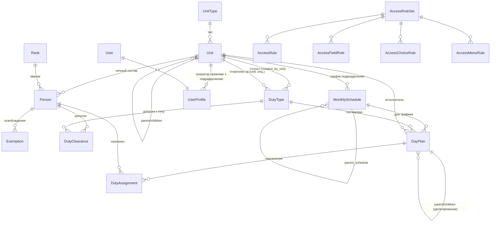

# Анализ legacy-системы

> Источник: `../duty_flow/duty_flow` (путь из `CLAUDE.md`) — Django-монолит, ~9 865 строк Python (без миграций и кэша; с миграциями и `manage.py`/скриптами — около заявленных 11 тыс.). Приложения: `access_control`, `core/services/*`, `units`, `ranks`, `people`, `duty_types`, `duty_plans`, `users_app`.
>
> Legacy служит **только справочником** по доменной логике и baseline для бенчмарков. Миграция данных из него не выполняется (`docs/open-questions.md` №19). Соседний проект `duty_flow_v2` решено не учитывать (№2).

## 1. Доменная модель

### 1.1 Сущности

| Приложение | Модель | Ключевые поля |
|---|---|---|
| `units` | `UnitType` | `name`, `slug`, `level` (0 = верх иерархии), `can_have_children` |
| `units` | `Unit` | `name`, `parent` (self FK), `unit_type` |
| `ranks` | `Rank` | `name`, `order` |
| `people` | `Person` | `last_name/first_name/middle_name`, `rank`, `unit` |
| `people` | `Exemption` | `person`, `reason` (illness/leave/trip/other), `date_from`, `date_to` |
| `people` | `DutyClearance` | `person`, `duty_type`, unique(`person`,`duty_type`) |
| `duty_types` | `DutyType` | `name`, `required_people` (**один флаг на весь наряд, без ролей**), `created_by_unit`, `unit` (опциональное закрепление) |
| `duty_plans` | `MonthlySchedule` | `month`, `unit`, `status` (draft/published/archived), `parent_schedule` (self FK) |
| `duty_plans` | `DayPlan` | `schedule`, `date`, `duty_type`, `unit`, `type` (own/incoming), `status` (pending/accepted, только для incoming), `child_status` (none/pending/accepted), `parent` (self FK) |
| `duty_plans` | `DutyAssignment` | `day_plan`, `person`, `assigned_by`, unique(`day_plan`,`person`) |
| `users_app` | `UserProfile` | `user` (1–1 Django `User`), `unit`, `created_by` |
| `access_control` | `AccessRuleSet`, `AccessRule`, `AccessFieldRule`, `AccessChoiceRule`, `AccessMenuRule` | см. §3 |

### 1.2 ER-диаграмма

Ключевое наблюдение: **у наряда нет состава по ролям** — `DutyType.required_people` это единое число, назначение проверяет только допуск (`DutyClearance`) и занятость/освобождение, без требований к званию или характеристикам (их в модели просто нет).

## 2. Бизнес-процессы

### 2.1 Создание графика и построение таблицы

`MonthlySchedule` уникален по (`month`, `unit`). `PlanService.build_table_data` строит для месяца множество дат × типов нарядов, которые надо показать: свои (`created_by_unit == base_unit`) плюс уже присутствующие в таблице (свои `own` или принятые `incoming`). `build_table_rows` раскрашивает ячейки по 8 классам состояния (own / delegated_pending / delegated_accepted / incoming_pending / incoming_active / incoming_delegated_pending / incoming_delegated_accepted / inactive) и решает `can_edit` по владению ячейкой.

### 2.2 Делегирование вниз по дереву

`PlanService.apply_unit_decisions` — сердце workflow:
1. Для ячейки (`date`, `duty_type`) в графике верхнего подразделения апсертится "корневой" `DayPlan` с `unit_id` = выбранное подразделение-исполнитель.
2. Рекурсивно удаляются старые дочерние `DayPlan` (`_delete_children_recursive`) и подчищаются опустевшие дочерние `MonthlySchedule` (`_cleanup_empty_child_schedule`).
3. Если исполнитель — не сам `base_unit`, у корневого плана выставляется `child_status = "pending"`, для дочернего подразделения через `get_or_create` создаётся (или переиспользуется) его `MonthlySchedule`, и в нём создаётся `DayPlan` с `type="incoming"`, `status="pending"`, `parent` = корневой план.
4. Дочернее подразделение видит входящий наряд и либо распределяет его дальше (рекурсивно, тот же механизм), либо принимает: `accept_incoming_plan` ставит `status="accepted"` и поднимает `child_status="accepted"` у родителя, а также **переводит статус дочернего расписания в `"active"`** — значение, которого нет в `MonthlySchedule.STATUS_CHOICES` (`draft/published/archived`). Это баг: Django не проверяет `choices` на уровне БД, поэтому невалидное состояние тихо сохраняется и не распознаётся формами/админкой, ожидающими `draft/published/archived`.
5. Отклонения входящего наряда как отдельного состояния **нет** — дочернее подразделение может либо принять, либо делегировать дальше; явного «отказа» с возвратом наверх не реализовано (см. открытый вопрос в `docs/open-questions.md`).

### 2.3 Назначение людей на наряд

`AssignmentService.get_available_people_for_plan`: кандидаты = сотрудники подразделения-исполнителя, у которых есть `DutyClearance` на `duty_type`, за вычетом уже назначенных и тех, у кого активно `Exemption` на дату. `can_assign_to_plan` дополнительно проверяет совпадение подразделения, наличие допуска, отсутствие освобождения и лимит `required_people`.

### 2.4 Автораспределение ячеек между подразделениями (`PlanAutomationService`)

Режимы: `balanced_structure`, `balanced_capacity`, `children_only_structure`, `children_only_capacity`, `prefer_own`, `prefer_children` (плюс legacy-алиас `balanced` → `balanced_capacity`). Режим раскладывается на два флага: `use_capacity` (учитывать ли кадровую ёмкость) и `children_only` (исключить ли сам `base_unit` из кандидатов).

Проход **по типу наряда, затем по датам** (комментарий в коде объясняет это желанием «естественного round-robin» внутри типа наряда) — то есть весь месяц для одного `duty_type` проходится последовательно от первого числа к последнему, при этом счётчики нагрузки (`unit_month_load`, `unit_duty_month_load`, `unit_daily_load`, `unit_daily_duty_load`, `unit_duty_rotation_load`) накапливаются **по ходу того же прохода** — они не предрассчитаны заранее для всего месяца, а инкрементируются после каждого назначения внутри цикла.

Для каждой кандидатной ячейки:
- Ёмкость через `_calculate_capacity(unit, duty_type, date)` — ORM-запрос: сотрудники подразделения с допуском на `duty_type`, без активного `Exemption` на дату, минус те, кто уже назначен в этот день (`DutyAssignment` по `person__unit=unit`).
- Скор — взвешенная сумма `total_month_load*8 + same_duty_month_load*4 + day_load*20 + day_same_duty_load*12` (веса — константы класса), опционально делённая на `headcount` (`normalize_by_headcount`); плюс бонус/штраф для `prefer_own`/`prefer_children`.
- **Сортировка кандидатов** — не по `score`, а по кортежу `(rotation_load, same_duty_month_load, total_month_load, day_same_duty_load, day_load, round(score,4), name)`. То есть реальный порядок выбора почти целиком определяется счётчиками ротации/нагрузки, а весь взвешенный `score` — лишь предпоследний, слабый тай-брейкер. Комментарий в коде честно признаёт это: «для production-логики важнее предсказуемая ротация, чем магический score». Формула весов существует, но почти не влияет на исход — это стоит явно унаследовать как урок (в новой системе скор должен реально управлять выбором, а не служить декорацией).
- Explainability: для каждой ячейки сохраняется top-5 кандидатов с разбивкой (`unit_name`, `score`, `headcount`, `capacity`, `month_load`, `same_duty_load`, `day_load`, `rotation_load`) — это лучше, чем просто строка, но ограничено top-5 и не сохраняется в БД (только в preview-ответе).

`apply_distribution` = вызов `preview_distribution` + запись через `PlanService.apply_unit_decisions` только тех ячеек, где `changed=True`. Это и есть паттерн «предпросмотр → применение», который стоит перенести в новую систему как обязательный контракт движка.

### 2.5 Автоназначение людей (`AssignmentAutomationService`)

Режимы `fill_only` (дозаполнить только нехватку) и `replace_all` (пересобрать состав целиком). Для каждого `DayPlan` своего подразделения со статусом `own`/принятый `incoming`:
- кандидаты = `get_available_people_for_plan` минус занятые в этот день на **других** планах (`_exclude_same_day_busy_people`);
- скор = `month_count*10 + same_duty_count*5 + recent_penalty`, где `recent_penalty` = +20, если человек стоял вчера, и ещё +30, если стоял и вчера, и позавчера подряд (`_recent_penalty` — единственное место, где явно учитывается минимальный отдых, и это **мягкий штраф, не жёсткое ограничение**);
- кандидаты сортируются по возрастанию скора (тай-брейк: `month_count`, `same_duty_count`, ФИО), берутся первые `need`.

Внутри месяца `_build_person_month_load`/`_build_person_same_duty_load` считают нагрузку строго по `year`/`month`, а `_recent_penalty` смотрит на абсолютные даты вчера/позавчера **независимо от границ месяца** (это единственное место, которое корректно работает на стыке месяцев — стоит перенести эту идею в скользящее окно новой системы).

## 3. Система прав (`access_control`)

Пятислойная декларативная модель поверх «уровня подразделения оператора» (`UserProfile.level` = `unit.unit_type.level`):

- **`AccessRule`** — можно ли `resource.action` для уровня `subject_level`, и если да — с каким `scope` (`none`, `own_unit`, `children`, `own_and_children`, `all_descendants`, `own_and_all_descendants`, `all`).
- **`AccessFieldRule`** — видимость/редактируемость конкретных полей ресурса для уровня, отдельно на `view`/`create`/`update`.
- **`AccessChoiceRule`** — что попадает в выпадающие списки (например, «в какие подразделения можно делегировать наряд»): по scope, по явному списку `units`/`unit_types`, по scope+явный список, либо «все значения».
- **`AccessMenuRule`** — видимость пункта меню для уровня.
- Разрешение правил идёт через `_get_rule`/`_get_field_rules`/`_get_choice_rule` в `access_control/services/base.py`: фильтр по активному `AccessRuleSet` (`is_default`/`code="default"`), `resource`, `action`, `subject_level`, `is_active=True`, сортировка по `priority` — берётся первое совпадение.
- **Двойная система**: каждый `*AccessService` (`UnitAccessService`, `PlanAccessService`, …) сначала ищет правило в новой таблице, а если его нет — падает на `_legacy_can`/`_legacy_visible_*`, которые местами делегируют в **отдельный старый** `users_app/access_service.py::AccessService` (используется также напрямую в `duty_type_service.py`, `people_service.py` — то есть миграция на декларативные правила не завершена, часть сервисов всё ещё жёстко использует старый объектный `AccessService`). Это явный технический долг, но сама модель (уровень × ресурс × действие × scope, с полями/списками/меню как надстройкой) — хороший прообраз для `libs/common` в новой системе.

`AccessContext.__post_init__` на **каждое** обращение к `AccessManager` (то есть практически на каждый HTTP-запрос оператора) вычисляет `descendant_unit_ids = user_unit.get_descendants_ids()` — рекурсивный обход дерева в Python с одним запросом на узел (см. §4). Для широкого поддерева это узкое место не только в автораспределении, а во **всей навигации приложения**.

## 4. Слабые места (проверено и дополнено)

Все заявленные в брифе проблемы подтверждены, часть — хуже, чем предполагалось:

1. **N+1 на `_calculate_capacity`.** Подтверждено, причём вызывается **дважды на unit×date**: сначала в `_is_unit_eligible_for_duty` — по одному запросу на каждую дату месяца для каждого кандидатного подразделения, чтобы найти `max_capacity` (нужно только для допуска unit к типу наряда в принципе), затем ещё раз в `_is_unit_eligible_for_date` — по запросу на каждую фактическую ячейку. Итого на один `duty_type` — до `2 × |units| × |dates|` ORM-запросов, каждый с `JOIN` на `clearances`/`exemptions`/`DutyAssignment`.
2. **N+1 на `_recent_penalty`.** Подтверждено — один запрос на каждую пару (кандидат, ячейка) внутри `preview_assignments`.
3. **Рекурсивный обход дерева в Python (`get_descendants_ids`).** Подтверждено — и это не только проблема движка распределения: `AccessContext` вызывает его на **каждый запрос** оператора верхнего уровня, то есть это горячий путь всего приложения, не только автораспределения.
4. **Жадный алгоритм «съедает» лучших кандидатов в начале месяца.** Подтверждено в обоих сервисах: `PlanAutomationService` идёт по датам от 1-го числа вперёд внутри каждого `duty_type`, `AssignmentAutomationService` обрабатывает планы, отсортированные по `(date, duty_type__name)` — оба процесса необратимо фиксируют ранние решения до того, как видна нагрузка на конец месяца.
5. **Справедливость только внутри календарного месяца.** Подтверждено буквально: `_build_unit_month_load`, `_build_unit_duty_month_load`, `_build_person_month_load`, `_build_person_same_duty_load` фильтруют строго по `year`/`month`. Долг не переносится. Частичное исключение — `_recent_penalty` смотрит на абсолютные даты вчера/позавчера вне границ месяца.
6. **Веса захардкожены, объяснение — строка `reason`.** Подтверждено (константы класса: `BASE_LOAD_WEIGHT=8`, `SAME_DUTY_WEIGHT=4`, `DAY_LOAD_WEIGHT=20`, `DAY_SAME_DUTY_WEIGHT=12`, `MONTH_ASSIGNMENT_WEIGHT=10`, `SAME_DUTY_WEIGHT=5`, `RECENT_ASSIGNMENT_PENALTY=20`, `CONSECUTIVE_DAY_PENALTY=30`). Дополнение: в `PlanAutomationService` посчитанный `score` к тому же почти не влияет на итоговый выбор (см. §2.4) — это хуже, чем просто «необъяснимо», это ещё и «не совсем то, что заявлено». В плюс: top-5/top-10 кандидатов с разбивкой по компонентам всё-таки сохраняются в preview-ответе (`candidates`/`candidate_debug`) — зачаток объяснимости, который стоит формализовать и сохранять в БД, а не только отдавать в ответ API.
7. **Нет состава наряда по ролям, требований к званию/характеристикам, минимального отдыха как жёсткого ограничения.** Подтверждено моделью данных: `DutyType.required_people` — одно число без ролей; `Rank`/характеристики нигде не участвуют в фильтрации кандидатов; отдых — не ограничение, а штраф `RECENT_ASSIGNMENT_PENALTY`/`CONSECUTIVE_DAY_PENALTY`, который не блокирует выбор, а только снижает приоритет (и то — до полного исчерпания более «дешёвых» кандидатов человек всё равно может быть поставлен два дня подряд).
8. **Гигиена репозитория.** Частично подтверждено, частично не соответствует описанию:
   - В корне репозитория лежат дампы `full_export.txt` (~581 КБ) и `project_snapshot_full.txt` (~558 КБ), а также бинарный `db.sqlite3` — всё закоммичено в git.
   - В `duty_flow/settings.py` — хардкод дефолтов для секретов: `SECRET_KEY = os.getenv("DJANGO_SECRET_KEY", "dev-secret-key-change-later")` и `"PASSWORD": os.getenv("POSTGRES_PASSWORD", "dutyflow_password")`. Если переменные окружения не заданы в проде, приложение тихо стартует с этими значениками.
   - **Не подтверждено**: в этом репозитории нет `docker-compose.yml` (а значит, нет и паролей в нём, и `runserver` в compose). Django запускается только через `manage.py`. Пункт брифа, видимо, относился к соседнему проекту `duty_flow_v2`, который решено не учитывать.

### Дополнительно найденные проблемы (не было в исходном списке)

- **Баг с невалидным статусом расписания**: `PlanService.accept_incoming_plan` присваивает `schedule.status = "active"`, а `MonthlySchedule.STATUS_CHOICES` содержит только `draft/published/archived`. Значение сохраняется (Django не валидирует `choices` на уровне БД), но нигде не обрабатывается как отдельный статус — по сути мёртвая ветка полу-состояния.
- **Незавершённая миграция системы прав**: часть сервисов (`DutyTypeService`, `PersonService`) всё ещё напрямую используют старый `users_app.access_service.AccessService`, минуя декларативный `AccessRule`-движок; часть новых `*AccessService` использует новый движок с fallback на старый. Двойная система усложняет сопровождение и должна быть полностью заменена в новой архитектуре, а не унаследована как есть.
- **Явного отклонения входящего наряда нет** — только «принять» или «делегировать дальше», срока на принятие тоже нет. Заказчик подтвердил, что так и должно остаться (`docs/open-questions.md` №12–13).

## 5. Что стоит сохранить в новой системе

- **Иерархический workflow делегирования** (`own`/`incoming`, `pending`/`accepted`, `child_status`, авто-создание/удаление дочерних расписаний и планов, рекурсивная отмена вниз по дереву при смене решения) — сам механизм устойчив и покрывает реальный процесс; в новой системе его стоит формализовать через явный конечный автомат состояний (`pending → accepted`, без отклонения и сроков) и перевести с уровня наряда на уровень роли (ADR-0009). Статус графика `"active"` из бага §4 в новой модели не нужен.
- **Scope-модель доступа** (уровень подразделения × ресурс × действие × 7 видов scope, плюс отдельные слои для полей/списков/меню) — концептуально верна и достаточно гранулярна; в новой системе стоит реализовать её как единую библиотеку в `libs/common`, без дублирования legacy/новый движок, и без завязки на Django ORM queryset-фильтрацию (переложить на SQL/`ltree`-предикаты).
- **Паттерн «предпросмотр → применение»** для обоих уровней автоматизации (по подразделениям и по людям) — контракт «чистая функция считает solution + explainability → отдельный шаг фиксирует только изменившееся» стоит сохранить как обязательное свойство нового движка распределения (см. `docs/allocation-design.md`).
- **Идея зачатков объяснимости** (ranked candidates с разбивкой по компонентам скора) — расширить до полного вектора признаков и причин отсева, сохраняемых в БД, а не только в ответе API.
